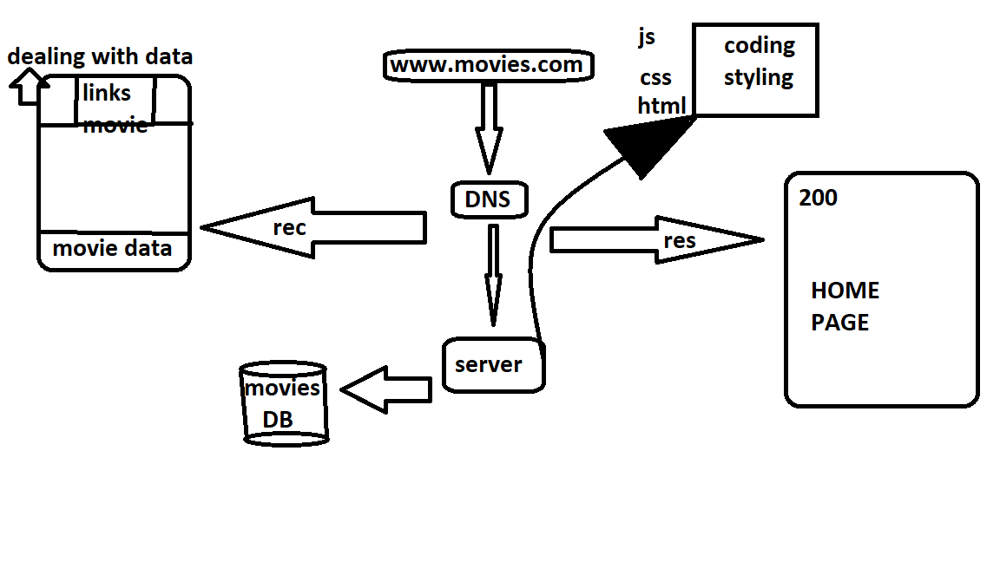

# Movies-Library
# Project Name - Project Version

**Author Name**: Bashar almhairat

## WRRC

## Overview

## Getting Started
.to start first from ubnut using npm start
then go to google chrom inter localhost:3000
and for exacte page you should enter :
localhost:3000/trending

## Project Features
for  now not that much but it include how to handel with error 404.500 .
afavorite page it,s show messag when you reach it thats it for now .
update:
now i can delet frome date base that we creat, add to the data base and
 select from it just like movie or delet if or add movie.